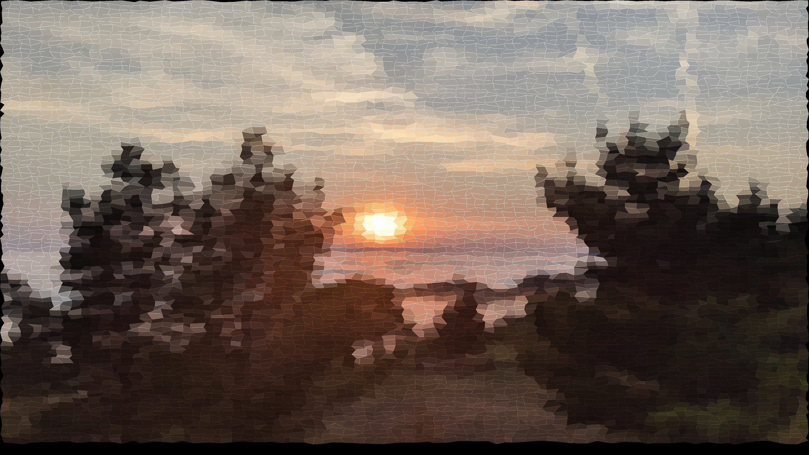

# Crystalize Image Filter
Crystalizing image filter inspired by the blurring effect in Black Mirror. 

### Implementation
I thought of the implementation in two steps. The first step was two generate a set of polygons that cover the image. The second was to set each of the polygons to the average color of the pixels it covered.

### Polygon Set
After a bit of tinkering, I landed on a fairly intuitive way to handling the polygon set. 

There were two collections I used to keep track of the polygons. A point set stored the position of each point. A polygon set stored a collection of polygons which were a set of four points. 

Each point started as a rectangle determined by a certain grid size. Every point is then moved around within certain degrees of freedom to a new location. The polygon set then updates its points to the new locations.

### Rendering
Rendering was straightforward, but I learned a few things about improving the runtime with NumPy operations. 

My idea with rendering was to use each polygon as a mask. Each polygon could essentially crop out a region from the original image. I would then assign this polygon region in the output image to be the average color of the pixels in the cropped region from the original image.

Rendering used to take several minutes with a large initial grid. However, after I changed the mask to only include the rectangular bounds of each polygon instead of the entire image, rendering time dropped to tens of seconds.

